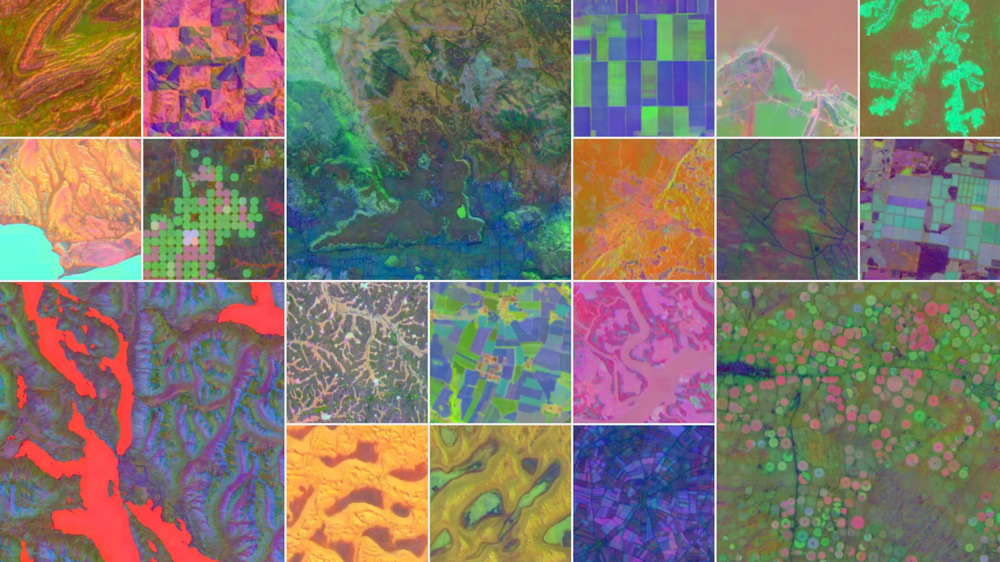

## Project overview

{#fig-alpha fig-align="center" width="100%"}

**MSHA - Multi-Scale-Spatial-Heterogeneity-Analysis** is a programming-focused geospatial project that quantifies how **homogeneous**, **complex**, and **spatially structured** a remote-sensing scene is, without requiring land-cover labels or training data.

The project builds an **unsupervised scene rating framework** for Sentinel-2 image patches using multi-scale spatial metrics derived from NDVI. Crucially, it also investigates **how scene heterogeneity and temporal change are captured differently** by these hand-crafted spatial statistics versus by **alpha embeddings**, learned, data-driven latent representations extracted from a self-supervised encoder.

The Plan:

- take a remote-sensing tile across **multiple timestamps**
- divide it into windows
- compute local texture and spatial statistics
- aggregate them into scene-level scores
- rank scenes by homogeneity, complexity, and spatial organization
- **extract alpha embeddings** for each scene and patch
- **compare how change and heterogeneity manifest** in the metric space versus the embedding space

## Question

Can remote-sensing scenes be automatically characterized and ranked using unsupervised multi-scale spatial metrics ; and does the structure of **alpha embeddings** agree with, complement, or contradict what those metrics reveal about heterogeneity and change over time?

## Study data

### Data source

**Sentinel-2 Level-2A imagery**.

**Google Alpha Embeddings**.

A practical dataset consists of:

- **4 to 6 scenes at the same or overlapping locations, across different timestamps**
- each scene cropped to **512 × 512 pixels**
- spatial resolution: **10 m**
- metric analysis performed on NDVI; embedding extraction on the full or selected band stack

Including multi-temporal acquisitions of the same location allows **change to be measured** both via metric drift and via embedding distance.

No land-type labels are required.

## Analytical framework

The analysis is performed at two parallel tracks:

### Track A ; Metric-based (MSHA)

1. **Window level**: compute local metrics inside windows
2. **Scene level**: aggregate window metrics into scene descriptors

### Track B ; Embedding-based (Alpha)

1. **Patch level**: extract alpha embeddings for fixed-size patches using a pretrained self-supervised encoder
2. **Scene level**: aggregate patch embeddings (e.g. mean pooling) into a scene-level descriptor vector

Both tracks operate without labels. The comparison focuses on which approach better separates scenes that differ in land-cover heterogeneity or have undergone temporal change.

### Multi-scale windows

The same image is evaluated at multiple window sizes:

- **32 × 32**
- **64 × 64**
- **128 × 128**

This allows the project to measure how scene structure changes with spatial support. Alpha embeddings are extracted at a fixed patch size (typically **64 × 64** or **128 × 128**) matching the encoder's expected input.

## Core metrics

The project uses five main metrics.

### 1. Shannon entropy

Measures information richness or disorder.

$$
H = - \sum_i p_i \log(p_i)
$$

Interpretation:

- low entropy = uniform scene
- high entropy = complex or irregular scene

### 2. Local variance

Measures variability inside each window.

$$
\sigma^2 = \frac{1}{N}\sum_i (x_i - \mu)^2
$$

Interpretation:

- low variance = homogeneous patch
- high variance = heterogeneous patch

### 3. Edge density

Computed from Sobel or Canny edges.

$$
ED = \frac{\text{number of edge pixels}}{\text{total number of pixels}}
$$

Interpretation:

- low edge density = smooth scene
- high edge density = many boundaries or fragmented structure

### 4. GLCM homogeneity

A texture smoothness metric derived from the gray-level co-occurrence matrix.

Interpretation:

- high value = smooth texture
- low value = rough or heterogeneous texture

### 5. Moran's I

Measures spatial autocorrelation.

$$
I = \frac{N}{W}
\frac{\sum_i \sum_j w_{ij}(x_i-\bar{x})(x_j-\bar{x})}
{\sum_i (x_i-\bar{x})^2}
$$

Interpretation:

- high positive values = clustered, spatially organized patterns
- values near zero = random arrangement

## Alpha embeddings

### What are alpha embeddings?

Alpha embeddings are **dense vector representations of image patches** produced by a self-supervised or foundation-model encoder trained on large remote-sensing datasets (e.g. SatMAE, Scale-MAE, or a ViT pretrained via masked autoencoders). The encoder maps each patch into a high-dimensional latent space **without any label supervision**.

The key property is that patches with similar visual or spectral content are pulled close together in embedding space, while dissimilar patches are farther apart ; even without the model ever being told what land-cover type a patch belongs to.

### Why compare with MSHA metrics?

MSHA metrics measure heterogeneity through **explicit, interpretable statistics** (entropy, texture, autocorrelation). Alpha embeddings capture heterogeneity implicitly through **learned feature geometry**. The two approaches may:

- **agree** in high-change or clearly heterogeneous scenes ; validating both methods
- **diverge** in ambiguous scenes ; revealing what each approach is sensitive to
- show complementary sensitivity ; motivating a **fusion** of metrics and embeddings

### Embedding extraction

For each patch:

1. Resize or crop to the encoder's expected input size
2. Pass through the pretrained encoder
3. Extract the `[CLS]` token or mean-pooled feature vector as the embedding $\alpha \in \mathbb{R}^d$

### Change detection via embedding distance

For a scene observed at two timestamps $t_1$ and $t_2$, the change signal for a patch can be estimated as:

$$
\Delta\alpha = \|\alpha_{t_2} - \alpha_{t_1}\|_2
$$

A high $\Delta\alpha$ indicates that the patch's visual content has shifted significantly in the latent space ; a proxy for land-cover or structural change.

This is compared directly against the **metric-based change signal**:

$$
\Delta M = \|M_{t_2} - M_{t_1}\|
$$

where $M$ is the vector of MSHA metrics (entropy, variance, edge density, etc.) for the same patch.

## Composite indices

The raw metrics are standardized using z-scores:

$$
z = \frac{x - \mu}{\sigma}
$$

### Homogeneity Index (HI)

A higher value indicates a more uniform scene.

$$
HI = z(\text{GLCM Homogeneity}) - z(\text{Entropy}) - z(\text{Variance}) - z(\text{Edge Density})
$$

### Complexity Index (CI)

A higher value indicates a more textured and fragmented scene.

$$
CI = z(\text{Entropy}) + z(\text{Variance}) + z(\text{Edge Density})
$$

### Spatial Structure Index (SSI)

A higher value indicates stronger spatial organization.

$$
SSI = z(\text{Moran's I}) + z(\text{GLCM Homogeneity})
$$

### Embedding-based heterogeneity score

For a scene, the **spread of patch embeddings** within the scene is used as an embedding-derived heterogeneity score:

$$
EHS = \frac{1}{P} \sum_{p=1}^{P} \|\alpha_p - \bar{\alpha}\|_2
$$

where $P$ is the number of patches and $\bar{\alpha}$ is the mean scene embedding. A higher EHS indicates that patches within the scene occupy diverse regions of the latent space ; analogous to a high CI.

## Expected outputs

### Output 1 ; Scene ranking table

A table comparing metric-based and embedding-based characterization side by side:

| Scene | Timestamp | Mean Entropy | Mean Variance | Mean Edge Density | Mean Moran's I | HI | CI | SSI | SIS | EHS | $\Delta\alpha$ |
|---|---|---:|---:|---:|---:|---:|---:|---:|---:|---:|---:|

### Output 2 ; Patch-level homogeneity maps

Maps showing where homogeneous and heterogeneous regions occur within a scene, derived from MSHA metrics.

### Output 3 ; Complexity maps

Window-based maps of CI values, with embedding-distance overlay for comparison.

### Output 4 ; PCA / UMAP plot of scenes

Dimensionality reduction applied to both **scene-level metric vectors** and **scene-level alpha embeddings** in the same figure, to visualize whether the two representations cluster scenes similarly.

### Output 5 ; Multi-scale comparison plot

A figure showing how scene metrics change across 32, 64, and 128 pixel windows.

### Output 6 ; Change detection comparison map

Side-by-side spatial maps of $\Delta M$ (metric-based change) and $\Delta\alpha$ (embedding-based change) for multi-temporal scene pairs, highlighting areas of agreement and disagreement.

### Output 7 ; Metric vs. embedding correlation plot

Scatter plots of CI vs. EHS and $\Delta M$ vs. $\Delta\alpha$ across all patches and scenes, with Pearson/Spearman correlation reported. This directly quantifies how well the two paradigms agree in capturing heterogeneity and change.

## Stack

**Language:** Python

**Libraries:** `numpy`, `pandas`, `rasterio`, `matplotlib`, `skimage`, `sklearn`, `torch`, `timm`, `umap-learn`

> `torch` and `timm` are required for loading pretrained encoders and extracting alpha embeddings. `umap-learn` is used for embedding-space visualization alongside PCA.